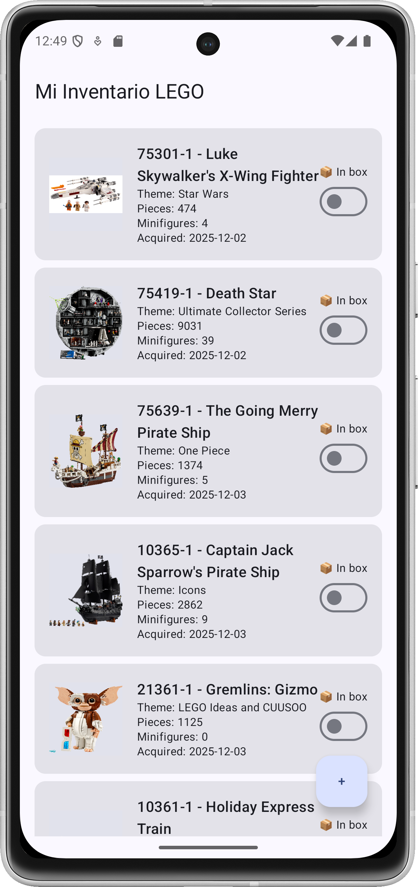
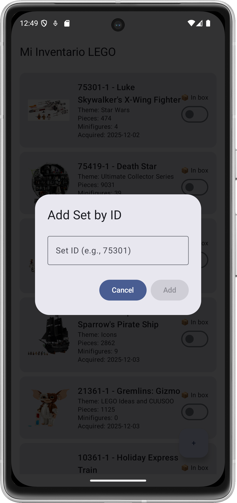

# BrickManager - LEGO Set Collection App

  

BrickManager is a modern Android application designed for LEGO enthusiasts to manage their collection. The app is built with a focus on a clean, scalable, and testable architecture.

---

## 📸 Screenshots

| Inventory Screen | Add Set Dialog |
| :---: | :---: |
|  |  |

---

## ✨ Features

*   **View Inventory**: See your entire collection of LEGO sets in a clean list, complete with images for each set.
*   **Add New Sets**: Add new sets to your collection by providing the official Set ID. The app fetches the set details and image from the Rebrickable API and adds it to your local database.
*   **Interactive Set Status**: Toggle a switch to mark a set as "Built" or "In Box". The change is saved and reflected instantly.
*   **Rich Data Display**: The app now shows the set's theme, minifigure count, acquisition date, and build date.
*   **Real-time Updates**: The UI automatically updates in real-time as your collection changes.
*   **Error Handling**: The app gracefully handles network errors or cases where a Set ID is not found.

## 🏗️ Architecture

This project follows the principles of **Clean Architecture**, with a clear separation of concerns between layers. The project is divided into three distinct modules:

### 1. `:domain` Module
*   **Purpose**: Contains the core business logic and models of the application. It is a pure Kotlin module with no dependencies on Android or any framework.
*   **Components**:
    *   **Entities**: Pure data classes (`Set`, `Brick`) that represent the core business objects.
    *   **Repository Interfaces**: Contracts (`InventoryRepository`) that define how data should be accessed by the domain.
    *   **Use Cases**: Encapsulate specific business rules (`GetSetInventoryUseCase`, `AddSetToInventoryUseCase`, `UpdateSetStatusUseCase`).

### 2. `:data` Module
*   **Purpose**: Implements the repository interfaces defined in the `:domain` layer. It is responsible for orchestrating data from various sources (local database, remote API).
*   **Components**:
    *   **Repository Implementations**: `InventoryRepositoryImpl` provides the concrete implementation of the data access logic.
    *   **Local Data Source**: Uses **Room** for local database persistence (`AppDatabase`, `SetDao`).
    *   **Remote Data Source**: Defined with **Retrofit** (`RebrickableApiService`) to fetch data from the Rebrickable API.
    *   **Mappers**: Extension functions to convert models between the `data` and `domain` layers, ensuring separation.

### 3. `:app` Module (Presentation Layer)
*   **Purpose**: Responsible for displaying the UI and handling user interaction.
*   **Components**:
    *   **UI (Jetpack Compose)**: Screens and components (`InventoryScreen`, `AddSetDialog`) built with modern, declarative UI.
    *   **ViewModel**: `InventoryViewModel` connects the UI to the business logic, manages UI state (`InventoryUiState`), and handles user events.
    *   **Dependency Injection**: **Hilt** is used to inject dependencies (ViewModels, Use Cases, Repositories) throughout the app.

## 🛠️ Tech Stack & Key Libraries

*   **Language**: [Kotlin](https://kotlinlang.org/)
*   **UI**: [Jetpack Compose](https://developer.android.com/jetpack/compose)
*   **Architecture**: Clean Architecture (Multi-Module)
*   **Asynchronous Programming**: [Kotlin Coroutines](https://kotlinlang.org/docs/coroutines-overview.html) & [Flow](https://kotlinlang.org/docs/flow.html)
*   **Dependency Injection**: [Hilt](https://developer.android.com/training/dependency-injection/hilt-android)
*   **Database**: [Room](https://developer.android.com/training/data-storage/room)
*   **Networking**: [Retrofit](https://square.github.io/retrofit/) & [Gson](https://github.com/google/gson)
*   **Image Loading**: [Coil](https://coil-kt.github.io/coil/) for loading images from URLs.
*   **Testing**:
    *   [JUnit 4](https://junit.org/junit4/)
    *   [MockK](https://mockk.io/) for mocking objects.
    *   [Turbine](https://github.com/cashapp/turbine) for testing Kotlin Flows.

## 🚀 Getting Started

1.  **Clone the repository**:
    ```sh
    git clone https://github.com/your-username/BrickManager.git
    ```
2.  **Open in Android Studio**:
    Open the cloned project in the latest stable version of Android Studio.
3.  **Add API Key**:
    Create a `local.properties` file in the root of the project and add your Rebrickable API key:
    ```properties
    rebrickable.api.key="YOUR_API_KEY"
    ```
4.  **Sync Gradle**:
    Let Android Studio sync the project dependencies.
5.  **Run the app**:
    Build and run the `:app` module on an emulator or a physical device.

## 🗺️ Roadmap / Possible Future Improvements

*   **Trading System**: Implement the `TradeRepository` and related UI to allow users to trade sets.
*   **Wishlist Functionality**: Implement the `getMissingBricksForWishlist` feature.
*   **User Authentication**: Add a login/signup system.
*   **UI Enhancements**: Improve the design with animations, more detailed set information screens, and better error states.
*   **Database Migrations**: Implement a proper Room migration strategy instead of using `fallbackToDestructiveMigration`.
